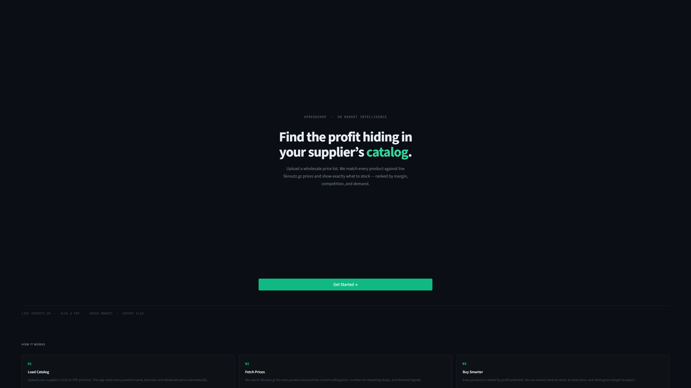
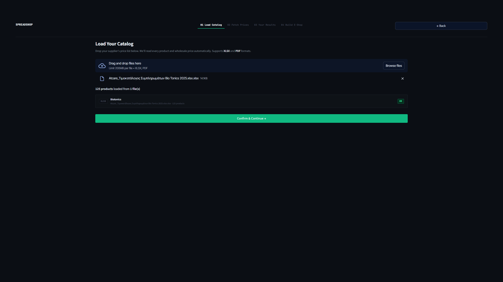
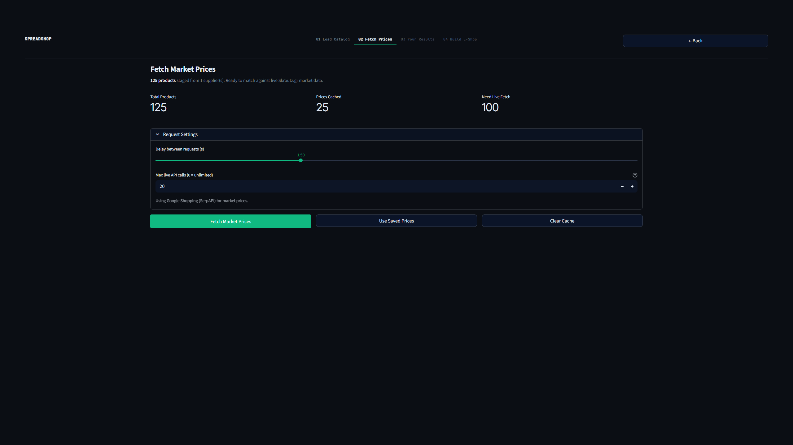
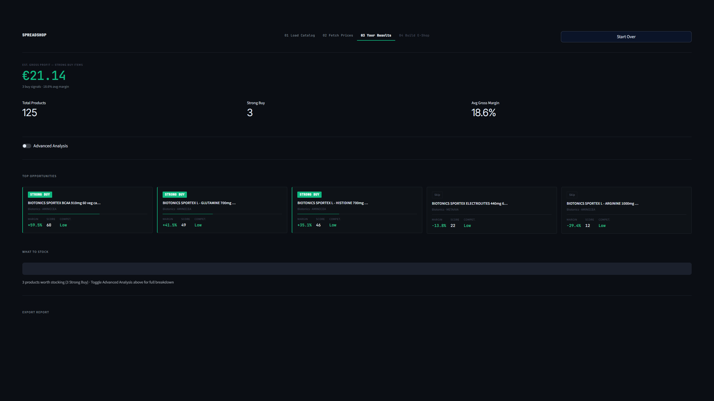
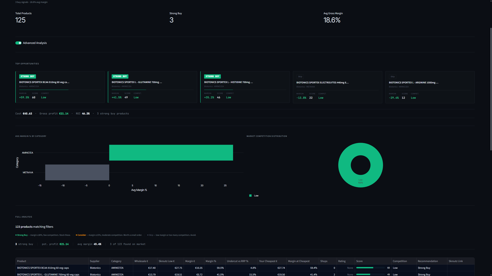
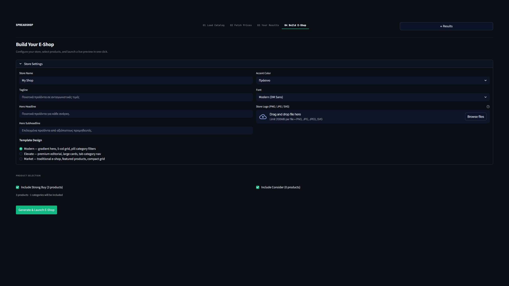
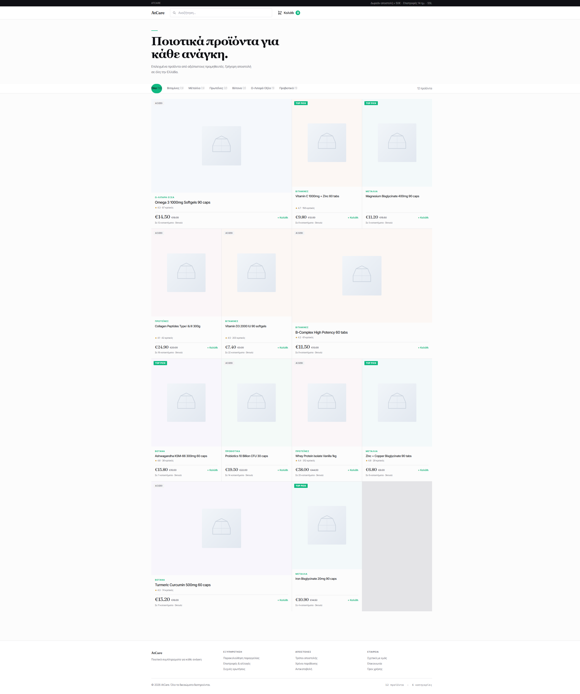
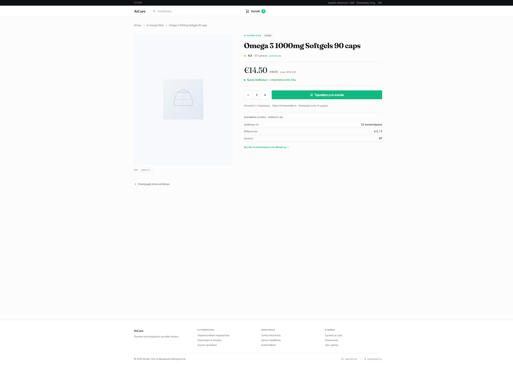
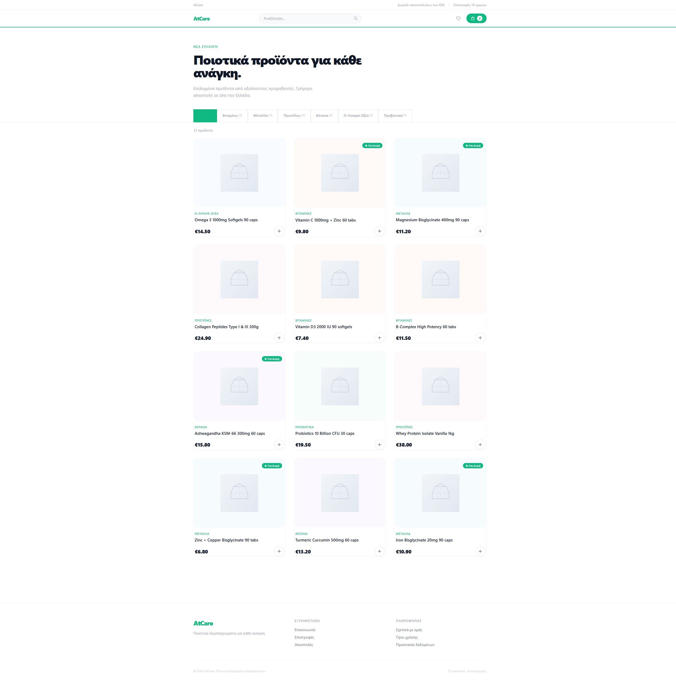
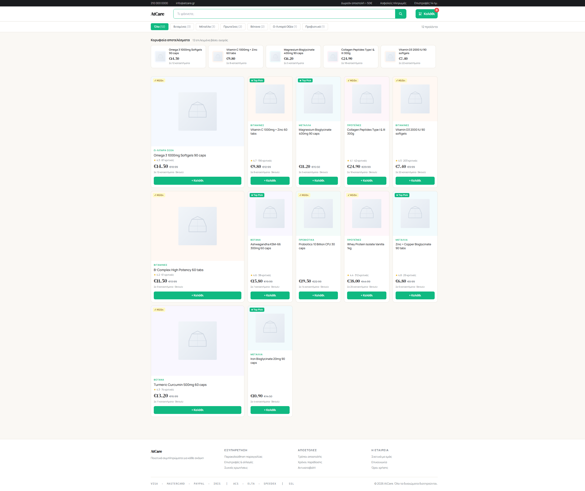

# Spreadshop

**Market intelligence for Greek resellers.** Upload a supplier price list, fetch live market prices from Skroutz.gr, and get a ranked list of which products are worth stocking — by margin, competition, and demand. Then generate a ready-to-preview e-shop in one click.

Built with Streamlit · Python 3.11 · httpx async · SerpAPI / Skroutz JSON · Jinja2

---

## Screenshots

### App — Refined Terminal UI

| Landing | Upload |
|---|---|
|  |  |

| Fetch Prices | Results — Basic |
|---|---|
|  |  |

| Results — Advanced (charts) | Build E-Shop |
|---|---|
|  |  |

### Generated E-Shop Templates

| T1 — Editorial (index) | T1 — Editorial (product) |
|---|---|
|  |  |

| T2 — Elevate | T3 — Agora Modern |
|---|---|
|  |  |

---

## What It Does

Greek resellers deal with supplier catalogs (XLSX/PDF) containing hundreds of products and wholesale prices. Without knowing what those products sell for on Skroutz.gr — Greece's dominant price-comparison marketplace — it's impossible to know which items are profitable.

Spreadshop solves this in four steps:

```
Upload catalog  →  Fetch live prices  →  See what to stock  →  Generate e-shop
    (XLSX/PDF)        (async, cached)        (margin ranked)       (3 templates)
```

For each product it calculates gross margin, competition level, and an opportunity score. Products are recommended as **Strong Buy**, **Consider**, or **Skip**.

---

## Features

- **Guided wizard flow** — Landing → Upload → Fetch Prices → Results → Build E-Shop. No tabs to hunt through.
- **Universal catalog parsing** — Reads supplier XLSX files and PDFs, including garbled-column VioGenesis PDFs with a purpose-built regex decoder.
- **Fast async scraping** — `httpx.AsyncClient` with configurable concurrency. No browser required.
- **Two scraper backends** — Native Skroutz JSON endpoint (free, fast) and Google Shopping via SerpAPI (more reliable, requires API key).
- **Smart caching** — Results cached 24 hours by barcode. Re-running is instant.
- **Simple / Advanced Results toggle** — Simple mode shows a clean "What to Stock" table. Advanced mode unlocks investment summary, charts, scatter plot, sidebar filters, and full 15-column analysis table.
- **E-shop generator** — Produces a static Jinja2 site (3 templates: Editorial, Elevate, Agora Modern) with a local preview server.
- **XLSX report export** — Multi-sheet report with opportunities, not-found products, and parse errors.
- **Refined Terminal UI** — Flat dark surface, Inter Tight + JetBrains Mono, single emerald accent, tabular numerals on every price and percentage. No gradients, no glow, no decorative backgrounds.

---

## Wizard Flow

```
┌─────────────────────────────────────────────────────────┐
│                      LANDING                            │
│  "Find the profit hiding in your supplier's catalog."   │
│              [ Get Started → ]                          │
└─────────────────────────┬───────────────────────────────┘
                          │
                          ▼
┌─────────────────────────────────────────────────────────┐
│           01 Load Catalog                               │
│  Drop XLSX or PDF. Auto-parsed, summary shown.          │
│              [ Confirm & Continue → ]                   │
└─────────────────────────┬───────────────────────────────┘
                          │
                          ▼
┌─────────────────────────────────────────────────────────┐
│           02 Fetch Prices                               │
│  Products staged. Concurrency, delay, cap.              │
│  [ Fetch Market Prices ]  [ Use Saved Prices ]          │
└─────────────────────────┬───────────────────────────────┘
                          │  auto-navigates when done
                          ▼
┌─────────────────────────────────────────────────────────┐
│           03 Your Results                               │
│  Est. Gross Profit  €3,450.00                           │
│  12 buy signals · 34.5% avg margin                      │
│                                                         │
│  ○ Advanced Analysis  ←── toggle                        │
│                                                         │
│  SIMPLE:  Top 5 opportunity cards + What to Stock table │
│  ADVANCED: invest summary, charts, filters, full table  │
│                                                         │
│  [ Download XLSX Report ]  [ Build E-Shop → ]           │
└─────────────────────────┬───────────────────────────────┘
                          │
                          ▼
┌─────────────────────────────────────────────────────────┐
│           04 Build E-Shop                               │
│  Pick template, configure store, select products.       │
│  [ Generate & Launch E-Shop ]                           │
│  ● running · preview at http://localhost:7891           │
└─────────────────────────────────────────────────────────┘
```

---

## Quick Start

### Local (dev)

```bash
# Python 3.11+
pip install -r requirements.txt

# Add SERPAPI_KEY to .env (or skip to use the Skroutz backend)
echo "SERPAPI_KEY=your_key_here" > .env

streamlit run app.py
# → http://localhost:8501
```

### Docker

```bash
git clone https://github.com/kdngiorgos/spreadshop.git
cd spreadshop
echo "SERPAPI_KEY=your_key_here" > .env
docker compose up -d --build
# → http://localhost:8080
```

The cache, reports, and logs directories are volume-mounted so they persist across container restarts.

---

## Configuration

All settings live in `.env` (never committed):

```dotenv
# Required for SerpAPI backend
SERPAPI_KEY=your_serpapi_key_here

# Optional overrides (defaults shown)
SPREADSHOP_SCRAPER=serpapi          # "serpapi" or "skroutz"
SPREADSHOP_HEADLESS=false           # set true in Docker
```

Tuneable constants in `config.py`:

| Constant | Default | Description |
|---|---|---|
| `SCRAPER_DEFAULT_DELAY` | `1.5s` | Base delay between requests |
| `SCRAPER_DEFAULT_JITTER` | `0.5s` | ±random jitter added to delay |
| `SCRAPER_CONCURRENCY` | `2` | Parallel async workers |
| `SCRAPER_MAX_RETRIES` | `3` | Retries on HTTP 429/503 |
| `SCRAPER_FUZZY_MATCH_THRESHOLD` | `0.35` | Min title similarity for a valid match |
| `CACHE_TTL_SECONDS` | `86400` | Cache lifetime (24 hours) |
| `MARGIN_STRONG_BUY_PCT` | `30%` | Minimum margin for Strong Buy |
| `MARGIN_CONSIDER_PCT` | `15%` | Minimum margin for Consider |
| `SHOPS_STRONG_BUY_MAX` | `10` | Max shops to qualify for Strong Buy |

---

## Supported Supplier Formats

### Bio Tonics — XLSX

Sheet: `Table 1`. Columns: `ΚΩΔΙΚΟΣ` (code), `ΠΕΡΙΓΡΑΦΗ` (name), `ΧΤ` (wholesale), `ΠΛΤ` (retail), `BARCODE`. Category header rows (text in col A, other cols empty) are detected and used to tag subsequent product rows.

### Bio Tonics — PDF

Same layout as XLSX, extracted via pdfplumber. Prices are comma-decimal strings (`"7,02"` → `7.02`). One known garbled row is handled by a regex that extracts `(\d+)[,.](\d{1,2})` from the raw cell value.

### VioGenesis — PDF

Complex garbled format where adjacent column text is interleaved in the price cells. Three purpose-built regex patterns decode the wholesale and retail prices:

| Pattern | Coverage | Example raw → decoded |
|---|---|---|
| Main | ~70 products | `gsr2//22w,401 €` → `22.40` |
| Single-digit | ~11 products | `gsr/9/2,w608 €` → `9.60` |
| Ads variant | ~2 products | `ads3/52,0071` → `35.00` |

All prices are validated against the expected wholesale/retail ratio (`0.48 – 0.78`). Rows outside this range are flagged as parse errors and excluded.

### Adding a new supplier

1. Create `parsers/pdf_newsupplier.py` (model it after `parsers/pdf_biotonics.py`)
2. Register it in `parsers/base.py` `parse_file()`:
   ```python
   if "suppliername" in name_lower:
       from .pdf_newsupplier import parse_newsupplier_pdf
       return parse_newsupplier_pdf(path)
   ```
3. Run `python scripts/demo.py` to validate

---

## Scraper Backends

### Skroutz (native JSON)

Uses Skroutz's own internal search endpoint with `httpx.AsyncClient` — no browser, no HTML parsing.

```
GET https://www.skroutz.gr/search.json?keyphrase={product_name}
```

1. If the response has a `redirectUrl`, follows it (`.html` → `.json`) to get the SKU list
2. Fuzzy-matches the best SKU by title similarity
3. Fetches `filter_products.json` for that SKU to get accurate per-variant prices and shop count
4. Falls back to barcode search if name search fails

**Pros:** Free, fast (no API quota), real Skroutz data  
**Cons:** Subject to Skroutz rate limits / structure changes

### SerpAPI (Google Shopping)

Uses the [SerpAPI](https://serpapi.com) Google Shopping engine with Greek locale.

**Pros:** More reliable, avoids Skroutz anti-scraping  
**Cons:** Requires a paid API key; shop count is a proxy, not exact Skroutz data

Switch backends via `.env`: `SPREADSHOP_SCRAPER=skroutz` or `SPREADSHOP_SCRAPER=serpapi`.

---

## E-Shop Generator

Step 4 produces a fully static HTML/CSS site from the analysis results using Jinja2 templates and launches a local preview server.

### Templates

| ID | Name | Description |
|---|---|---|
| `t1` | Editorial | Fraunces serif display + asymmetric grid. Featured card every 5th product. |
| `t2` | Elevate | Underline-tab category nav, large image cards, clean sans-serif. |
| `t3` | Agora Modern | Greek typographic rhythm, Skroutz signals (reviews, shops) prominently displayed. |

### Output

```
eshop_preview_t1/
├── index.html          # product grid
├── product/
│   └── *.html          # one page per product
├── static/
│   └── placeholder.svg
└── site_config.json
```

The local preview server runs at `http://localhost:7891` (configurable). Stop it from the app UI or by restarting Streamlit.

---

## Analysis Logic

### Per-product metrics

```python
margin_absolute = skroutz_lowest_price - wholesale_price
margin_pct      = (margin_absolute / wholesale_price) × 100

competition_level = "Low"    # ≤ 4 shops
                 = "Medium"  # 5–15 shops
                 = "High"    # > 15 shops
```

### Opportunity score (0–100)

```
margin_score  = min(margin_pct / 100, 1.0) × 50   # 50% weight
comp_score    = max(0, (30 - shop_count) / 30) × 30  # 30% weight
demand_score  = min(review_count / 100, 1.0) × 20  # 20% weight
score         = margin_score + comp_score + demand_score
```

### Recommendation labels

| Label | Condition |
|---|---|
| `Strong Buy` | margin ≥ 30% **and** shops ≤ 10 |
| `Consider` | margin ≥ 15% |
| `Skip` | margin < 15% or not profitable |
| `Not Found` | product not matched on market |

---

## Project Structure

```
spreadshop/
│
├── app.py                      # Streamlit UI — 4-screen wizard
│
├── parsers/
│   ├── base.py                 # ProductRecord, SkroutzResult, ParseError · parse_file()
│   ├── xlsx_parser.py          # Bio Tonics XLSX (openpyxl)
│   ├── pdf_biotonics.py        # Bio Tonics PDF (pdfplumber)
│   └── pdf_viogenesis.py       # VioGenesis PDF (pdfplumber + garble decoder)
│
├── scraper/
│   ├── __init__.py             # get_scraper() factory
│   ├── skroutz.py              # Native Skroutz JSON endpoint client
│   ├── serpapi_client.py       # SerpAPI Google Shopping client
│   ├── runner.py               # run_scrape() — shared by UI, CLI, and tests
│   └── cache.py                # JSON file cache (24h TTL, keyed by barcode)
│
├── analysis/
│   ├── compare.py              # Margin %, opportunity score, recommendations
│   └── export.py               # Multi-sheet XLSX report (openpyxl)
│
├── eshop/
│   ├── generator.py            # Jinja2 static site generator
│   ├── site_config.py          # SiteConfig dataclass + defaults
│   ├── server.py               # Local preview server (threading + http.server)
│   └── templates/
│       ├── base.html.j2        # Shared base (nav, cart, CSS tokens)
│       ├── t1/                 # Editorial template (Fraunces + Inter Tight)
│       ├── t2/                 # Elevate template
│       └── t3/                 # Agora Modern template
│
├── scripts/
│   └── demo.py                 # Proof-of-concept: all parsers + mock analysis + export
│
├── tests/
│   ├── conftest.py
│   ├── test_runner.py
│   ├── test_cache.py
│   ├── test_compare.py
│   └── test_eshop_generator.py
│
├── config.py                   # All tuneable constants + env loading
├── logger.py                   # Logging setup
├── Dockerfile
├── docker-compose.yml
├── requirements.txt
└── .streamlit/
    └── config.toml             # Dark theme (Inter Tight, #10B981 emerald accent)
```

---

## Development

### Running tests

```bash
pip install pytest pytest-asyncio
pytest
# 143 passed, 1 skipped
```

### Proof-of-concept run (no browser needed)

```bash
python scripts/demo.py
# Parses 207 products, runs analysis with mock data, exports reports/demo_report.xlsx
```

### Linting / type checks

```bash
pip install ruff mypy
ruff check .
mypy app.py scraper/ parsers/ analysis/
```

---

## Tech Stack

| Layer | Library |
|---|---|
| UI | [Streamlit](https://streamlit.io) 1.55 |
| HTTP client | [httpx](https://www.python-httpx.org) (async) |
| Market data | [SerpAPI](https://serpapi.com) / Skroutz JSON |
| PDF parsing | [pdfplumber](https://github.com/jsvine/pdfplumber) |
| XLSX I/O | [openpyxl](https://openpyxl.readthedocs.io) |
| Charts | [Plotly](https://plotly.com/python/) |
| E-shop templates | [Jinja2](https://jinja.palletsprojects.com) + Tailwind CDN |
| Containerisation | Docker + Compose |

---

## License

MIT — see [LICENSE](LICENSE) if present, otherwise use freely with attribution.
